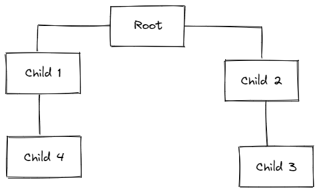
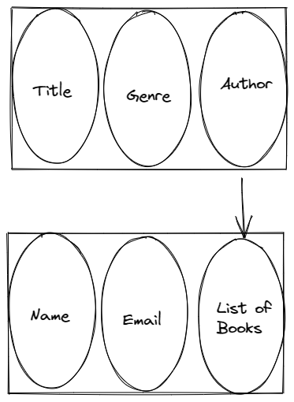

# Introduction to relational databases (RDBMS)

## Relational database concepts
Our world is filled with data and new data is being created every second. Data is all of the unorganized information that is available in the world, it consists of facts, images, numerical values, and even special symbols or a mix of all of them.

Data can be categorized into many different kinds based on the structure of it. The most common data is unstructured data which doesn't have any way to organize it. Semi-structured data is data that has some properties that can help us to loosely sort it. Structured data is the best kind of data and the data that is most required, structured- data is organized neatly in rows and columns and is manageable easily and is also easy to work with.

NoSQL databases like MongoDB and Firebase are used to store unstructured data and semi-structured data. Semi-structured data can also be stored in a SQL database like MySQL and Postgres along with structured data. When selecting a database solution for your work it is really important that you first look and analyze the type of data you're going to be working with so that your chosen database system can handle all of the requirements. 

Today, data is available from multiple sources like old databases, flat files, paper journals, and data sets that contain data that has either been collected by people or by IoT devices. All of this data can be used to provide insights that can improve the performance of businesses and products that people rely on a daily basis.

Data exists in many common forms and types; the most common ones include delimited files in which each variable is separated using either commas or tabs. Spreadsheets are also a common way to store data in a row-column fashion and spreadsheet data can also be exported as de-limited data and vice versa.

Programming languages like XML and JSON that are independent and light weight are most common for storing un-structured data since they have some set of rules that defines a structure that makes data somewhat readable and can be accessed using any application.

Online transaction systems such as an ATM or restaurant checkout machine are optimized for all of the daily operations that customers do every day and these systems mostly use relational databases for storing their information because the way the database is designed makes the application perform as needed while making sure that data is not duplicated or entered incorrectly. Online analytical processing systems might use a combination of both relational and NoSQL databases. If the system is a big and complex one then they also use data lakes, data warehouses and other big data sources.

## Information and data models
An information model is a formal representation of all the entities (which can be modeled after real-life objects) in a database along with their properties, relationships, and all of the operations that can be performed on that data.

Information and data models both are different things and serve different purposes, information models are conceptual level models that define the relationships between objects while data models are more specific and include a lot of other details. Data models are like blueprints of the database that define all the exact details about the database.

There are multiple types of information models and the most common one is the hierarchical model which is typically used in organizational charts that follow a parent-child tree-like structure. The first node or the root node is called the parent node and all following nodes are the child nodes. This structure follows the real-life example of one parent having multiple children but one child can only have a single parent.

The world's first hierarchical database system was the information management system that was released by IBM in 1968 and was built as the database to be used on the Apollo space program.  The relational model is the most common database model since it allows for both logical and physical independence.

Entity-relationship models are an alternative to relational data models. Entities are the variables that represent real-life values like names, places, or things and each entity has its own attributes like a book entity can have author, title, and genre as its attributes.

The entity then becomes a table in the database and the attributes becomes the columns of the table.

## Entities and thier relations
In an entity-relation based database entities are represented by a rectangle and their attributes are represented using ovals in the ER diagram and relations are represented using diamonds and lines that connect different entities together.

Entity relationships can be a bit complex at times like a book must have an author and a publishing data and the author of the book must have a name, email, and other details as well.  The author can also have multiple books and books can have multiple authors as well.

When a single entity has a relation with another entity its called a one-to-one relationship, when a single entity has multiple relations with another entity its called a one-to-many relationship and when both entities have multiple relations with each other than its called a many-to-many relationship.

## Mapping entities to tables
Entity relation diagrams or ERD’s are the most important thing when designing a relational database. Almost all databases are started with designing an ER diagram and then we map the tables in the database to the diagram. The book entity now becomes a table and all of its attributes become columns.

